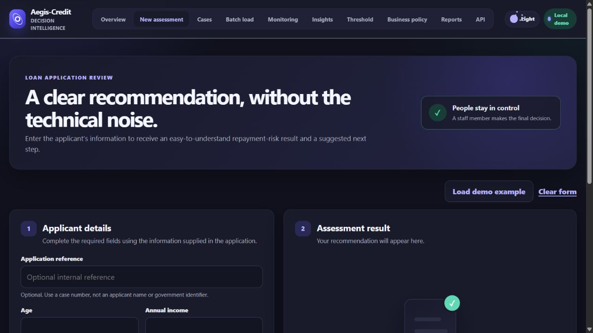

# Aegis-Credit

Aegis-Credit is an end-to-end credit-risk screening and model-governance
project for **regional and specialty lenders** that need a controlled,
human-reviewed application triage workflow before committing to a full lending
platform replacement. It combines a demonstration model with durable case
records, batch applicant loading, monitoring, threshold economics,
authenticated API scoring, and deployment controls.

It is designed for learning, portfolio demonstrations, and development of a
possible future controlled-pilot workflow. The checked-in data and model are
not approved for a controlled pilot. The application does not approve or
decline credit and does not generate compliant adverse-action notices.

## Product capabilities

- blank-by-default applicant assessment with an explicit demo-data option;
- validated application-time inputs and unusual-value warnings;
- calibrated probability, reachable Low/Medium/High bands, and staff guidance;
- model-behavior explanations clearly separated from adverse-action reasons;
- durable assessment cases with assignment, SLA timing, immutable reviews, legal holds, and mature outcomes;
- idempotent web/API scoring and keyed audit fingerprints;
- CSV and Excel batch upload with durable queued rows, retry/cancel controls, validation warnings, and downloadable results;
- version-filtered volume, risk, outcome, drift, and acknowledged monitoring runs;
- versioned financial threshold scenarios with recorded administrator decisions;
- scoped analyst, reviewer, legal-officer, and administrator roles;
- OpenAPI documentation, API-key authentication, and rate limiting;
- SQLite for local use and PostgreSQL support for shared deployments;
- Windows launchers, Docker Compose, Render configuration, health checks, and CI.

## Target client and deployment boundary

The target buyer is a lender with a small-to-mid-sized underwriting operation
that already has a loan-origination system (LOS) but lacks a governed review
queue and score-consumption workflow. Aegis-Credit is intentionally a
**single-tenant deployment**: one client organization and its staff are served
by one isolated database and deployment. It is not represented as a shared
multi-client SaaS.

The versioned scoring API is the integration boundary for an LOS: callers send
one application with a client-specific API key and idempotency key, receive a
case ID, and retain that ID in the originating system. See the API reference
and `docs/LOS_INTEGRATION.md` for the contract, reconciliation expectations,
and rollout plan.

## Checked-in demonstration model

Version `2.2.0` is an unsigned, hash-checked local demonstration artifact. It
is trained from the repository's deterministic synthetic data using the current
canonical loan-to-income feature contract. It is eligible only for the
explicitly labeled local demo mode and can never be promoted for shared or
production scoring.

The regenerated reports are useful for checking that the complete pipeline is
internally consistent. Their ROC-AUC, calibration, fairness, and threshold
figures are not evidence of lending performance because the labels are
simulated. No historical metric is published as validation of the current
scoring contract.

## Current interface



This current local-demo capture shows the blank assessment workflow and its
prominent demo-status boundary. It uses only synthetic data. A public online
demo is intentionally not deployed: publishing one requires the lender's
hosting, authentication, and data-governance approval.

## Historical validation design

The synthetic demonstration dataset is divided into five non-overlapping
partitions during the artifact build:

- training, model-selection, probability-calibration, threshold-selection, and
  final-test partitions are recorded in `models/model_manifest.json` for the
  exact generated artifact.

Preprocessing remains inside scikit-learn pipelines. Feature-reference and drift
baselines are built from training rows only. Loan grade and interest rate are
excluded from application-time scoring because they may be lender-assigned.
Age is excluded from the score and used only for plausibility checks and limited
monitoring. A new release must repeat the complete evaluation with the canonical
derived ratio before these metrics can be relied on.

## Quick start

### Local development (one command)

Install Python 3.12 or newer, then run this from the project directory:

```bash
python run.py
```

On Windows, `py run.py` works too, or double-click `Start Aegis-Credit.bat`.
The command creates `.venv`, installs only the dashboard dependencies when
needed, creates persistent local development keys, applies migrations, and
opens `http://127.0.0.1:8000/`. Subsequent launches reuse the environment and
keys, so locally encrypted case records remain readable.

Use `python run.py --no-browser` on a headless machine and
`python run.py --check` to validate the setup without starting the server.
Local access control is disabled by default because the server listens only on
`127.0.0.1`. The launcher does not bypass model-release or data-provenance
controls for production. It enables an explicitly labeled local demo mode that
checks the bundled model against its manifest hash. Demo scores are for UI and
workflow evaluation only and are not approved lending decisions.

### Windows with Docker Desktop

Double-click `Start Aegis-Credit Docker.bat`. This starts the application
and a durable local PostgreSQL database. It creates an ignored
`.aegis-credit-docker.env` containing local-only demonstration secrets.

### Any platform with Docker

```bash
python run.py docker-env
docker compose --env-file .aegis-credit-docker.env up --build
```

The generated file is for a loopback-bound local demonstration only. Never use
it in a shared environment or copy its secrets into a production deployment.

### Developer setup

First let the local launcher create stable, untracked development keys and the
application environment:

```bash
python run.py --check
```

Activate that environment, install the full development dependencies, and load
the generated `.aegis-credit-local.env` before invoking `manage.py` directly.

PowerShell:

```powershell
.\.venv\Scripts\Activate.ps1
python -m pip install -r requirements.txt
Get-Content .aegis-credit-local.env | ForEach-Object {
    if ($_ -match '^(?<name>[^#=]+)=(?<value>.*)$') {
        Set-Item -Path "Env:$($Matches.name)" -Value $Matches.value
    }
}
python manage.py check
```

macOS/Linux:

```bash
source .venv/bin/activate
python -m pip install -r requirements.txt
set -a
. ./.aegis-credit-local.env
set +a
python manage.py check
```

Once that environment is loaded, normal Django commands work:

```bash
python manage.py migrate
python manage.py bootstrap_roles
python manage.py runserver
```

Direct `manage.py` commands intentionally fail when mandatory keys are absent.
Production and CI must inject those values through their secret-management
environment rather than loading the local file.

## Authentication and roles

Set `LOGIN_REQUIRED=True` for any shared deployment. Create role groups and an
optional first administrator with:

```bash
python manage.py bootstrap_roles
```

The optional environment variables are:

```text
BOOTSTRAP_ADMIN_USERNAME
BOOTSTRAP_ADMIN_PASSWORD
BOOTSTRAP_ADMIN_EMAIL
```

Roles:

- **Analysts** can score, load batches, and view cases they created or were assigned.
- **Reviewers** can manage the case queue, record reviews and mature outcomes, and view governance pages.
- **Legal officers** can view cases and monitoring and place or release documented legal holds; they cannot score, review, or change policy.
- **Administrators** have reviewer and legal-hold access, approve or reject policy scenarios, and can use Django administration.

## Batch applicant loading

Open `/batch/` or download `/batch/template.csv`. Supported files are `.csv`
and `.xlsx`. Required columns:

```text
person_age
person_income
person_emp_length
person_home_ownership
loan_amnt
loan_intent
cb_person_cred_hist_length
cb_person_default_on_file
```

The `applicant_reference` column is required, but its row values may be blank.
Use an internal case number, not a name, account number, or government
identifier. Unknown columns are rejected. Invalid rows are reported separately
and are not scored. Field definitions, ranges, category codes, cross-field
checks, and file limits are in [the application input contract](docs/INPUT_CONTRACT.md).

Local development processes rows inline. When `BATCH_PROCESS_INLINE=False`, run
the durable worker as a separately supervised process:

```bash
python manage.py process_batches
```

Use `python manage.py process_batches --once` only for maintenance or smoke
checks. The batch page reports queued, processing, failed, cancellation, and
row-warning states; retrying retains already completed durable rows.

## Scoring API

Add a client credential to `SCORING_API_KEYS` (the deprecated
`SCORING_API_KEY` remains available during migration), then use:

```text
POST /api/v1/score/
X-API-Key: <key>
Idempotency-Key: <UUID>
Content-Type: application/json
```

The static quick reference is at `/api/docs/`; the machine-readable OpenAPI
document is at `/api/v1/openapi.json` and can be imported into an approved
interactive viewer or client generator.

The endpoint uses the same validation contract as the web form, enforces a
configurable per-minute limit, stores a case, and returns the same result when
an idempotency key is replayed. It deliberately omits local explanations for
latency and governance reasons.

## Monitoring and validation commands

Compare incoming feature distributions with the training baseline:

```bash
python -m src.monitor_model --data path/to/new_applicants.csv \
  --output reports/drift_monitoring.csv
```

For the deliberately unsigned bundled local demonstration only, add
`--allow-unsigned-demo`. Approved deployments must omit that flag and use the
signed active release.

Preview a persisted monitoring run from the representative raw input CSV, then
repeat with `--confirm` after review. The command recomputes drift itself and
binds the result to the input digest and active model release:

```bash
python manage.py record_monitoring_run path/to/new_applicants.csv \
  --window-start YYYY-MM-DD --window-end YYYY-MM-DD --as-of YYYY-MM-DD \
  --owner "Model Risk"

python manage.py record_monitoring_run path/to/new_applicants.csv \
  --window-start YYYY-MM-DD --window-end YYYY-MM-DD --as-of YYYY-MM-DD \
  --owner "Model Risk" --confirm
```

Import mature case outcomes from a controlled CSV feed with an active staff
account. The first command is an atomic dry run; only the second persists
immutable outcomes:

```bash
python manage.py import_outcomes outcomes.csv --actor reviewer_username
python manage.py import_outcomes outcomes.csv --actor reviewer_username --confirm
```

The required outcome schema, label mapping, maturity rules, and monitoring
runbook are documented in [the operations guide](docs/OPERATIONS.md#outcome-ingestion).

Evaluate a labeled external or out-of-time sample:

```bash
python -m src.validate_external --data path/to/mature_outcomes.csv
```

Production commands require a signed release. For an isolated smoke test of the
checked-in demo artifact, add `--allow-unsigned-demo`; never use that flag in a
shared environment. See [ML Development and Release Contract](docs/ML_DEVELOPMENT.md).

Preview or execute data retention:

```bash
python manage.py purge_old_cases --days 365
python manage.py purge_old_cases --days 365 --confirm
```

Release retraining (only after data provenance approval):

```bash
python -m src.train_model --release
```

`--quick` is intentionally rejected for release builds. The command requires a
clean worktree, exactly one `model-v2.2.0` tag at `HEAD`, approved data
provenance, and an Ed25519 private signing key supplied through a secret
manager. The checked-in demonstration artifact remains eligible only for the
explicit local demo mode; it cannot be promoted for shared or production
scoring.

## Production configuration

Copy `.env.example` as a reference. Important settings include:

| Variable | Purpose |
|---|---|
| `SECRET_KEY` | Django cryptographic secret |
| `AUDIT_HMAC_KEY` | Separate key for applicant-feature fingerprints |
| `AUDIT_HMAC_KEYS` | Active HMAC key followed by retained lookup keys during rotation, comma-separated |
| `FIELD_ENCRYPTION_KEY` | Fernet key for persisted applicant fields |
| `FIELD_ENCRYPTION_KEYS` | Active field key followed by retained read keys, comma-separated |
| `BACKUP_ENCRYPTION_KEY` | Separate Fernet key for database backups |
| `MODEL_SIGNING_PUBLIC_KEY` | Ed25519 public key used to verify model releases |
| `DATABASE_URL` | PostgreSQL connection URL |
| `DB_SSL_REQUIRE` | Require TLS parameters for the production database connection |
| `LOGIN_REQUIRED` | Enforce staff authentication |
| `DEPLOYMENT_TENANT_ID` | Required opaque identifier for the lender's single-tenant deployment/database |
| `SCORING_API_KEYS` | JSON map of per-client API secrets for independent attribution and rotation |
| `SCORING_API_KEY` | Deprecated compatibility secret, exposed as client `legacy` |
| `API_RATE_LIMIT_PER_MINUTE` | API request ceiling |
| `CASE_RETENTION_DAYS` | Retention-command default |
| `DATA_PROVENANCE_VERIFIED` | Enables only formally approved training data |
| `LOCAL_DEMO_MODE` | Loads the hash-checked bundled model for local demonstrations only |
| `MAX_BATCH_ROWS` | Batch row limit |
| `MAX_UPLOAD_BYTES` | Upload size limit |
| `MAX_XLSX_UNCOMPRESSED_BYTES` | Maximum total uncompressed XLSX payload (default 50 MiB) |
| `MAX_XLSX_ARCHIVE_MEMBERS` | Maximum files inside an XLSX archive (default 2,000) |
| `MEDIA_ROOT` / `MEDIA_URL` | Storage used only by legacy file-backed batches or future media features |
| `MEDIA_STORAGE_BACKEND` | Backend for legacy/future media; new queued payloads are encrypted in the database |
| `CASE_REVIEW_SLA_HOURS` | Hours before an open case is marked overdue (default 48) |
| `CASE_PAGE_SIZE` | Cases displayed per page (default 50) |
| `MONITORING_FRESHNESS_HOURS` | Maximum age of monitoring evidence before it is stale (default 24 hours) |
| `MONITORING_MIN_SAMPLE_SIZE` | Minimum valid rows in a persisted monitoring window (default 100) |
| `CURRENCY_CODE` | Optional approved ISO 4217 display code; blank uses neutral monetary units |
| `BATCH_PROCESS_INLINE` | Process uploads synchronously only in development (defaults to `DEBUG`) |
| `BATCH_LEASE_SECONDS` | Worker heartbeat lease before an interrupted batch is recovered (default 300) |
| `BATCH_MAX_ATTEMPTS` | Maximum processing attempts before a batch remains failed (default 3) |

Shared deployments must use PostgreSQL. SQLite is intentionally retained only
for local single-user operation.

## Project structure

```text
app/                  Django workflows, templates, forms, models, and tests
aegis_credit/         Django settings and URL configuration
data/                 Demonstration dataset
models/               Versioned model bundle and integrity manifest
reports/              Generated evaluation and governance reports
src/                  Training, drift monitoring, and external validation
docs/                 User and operations guidance
Dockerfile            Production-style container image
docker-compose.yml    Local PostgreSQL deployment
render.yaml           Render web service and PostgreSQL blueprint
MODEL_CARD.md          Intended use, metrics, limitations, and controls
DATA_CARD.md           Data quality, representation, privacy, and provenance
```

The externally owned production gates are tracked in
`docs/GOVERNANCE_CHECKLIST.md`.
Setup failures and removal steps are covered in `docs/TROUBLESHOOTING.md`.
Staff workflows are documented in `docs/USER_GUIDE.md`. Historical interface
images and the current screenshot checklist are described in `docs/images/README.md`.
Optional view-context hooks for the enhanced product states are documented in
`docs/FRONTEND_INTEGRATION.md`.
The dedicated LOS handoff contract is in `docs/LOS_INTEGRATION.md`.
The exact web, API, and batch schema is documented in
`docs/INPUT_CONTRACT.md`.

## Verification

Load the mandatory environment values as described in **Developer setup**, then
run:

```bash
python manage.py migrate
python manage.py check
python manage.py makemigrations --check --dry-run
python manage.py test
python -m compileall -q app aegis_credit src
python -m pip check
```

## Licensing and provenance

Project source code is licensed under the MIT License. The included synthetic
demonstration dataset is dedicated under CC0 1.0; see `DATA_PROVENANCE.md` and
`data/LICENSE.md`. It has no real-world geographic scope, collection period,
or lending population and must not be operationalized.

## What code cannot complete

Real lending use still requires organization-specific work:

- representative bank and product data with mature outcomes;
- approved input currency, units, source timing, category definitions, and
  authoritative outcome-label mapping;
- approved PD/LGD/EAD and profitability assumptions;
- independent model validation and change approval;
- legal and fair-lending review using appropriate protected-class analysis;
- validated, specific adverse-action reason mapping;
- enterprise identity, MFA, access recertification, and tamper-evident audit
  retention appropriate to the deployment;
- authenticated or independently recomputed monitoring inputs and approved
  alert/escalation ownership;
- penetration testing, incident response, backups, and recovery exercises;
- human staffing, service-level targets, override governance, and periodic review.

The system is decision support. It must not be treated as an autonomous credit
decision engine.
